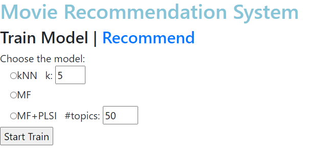
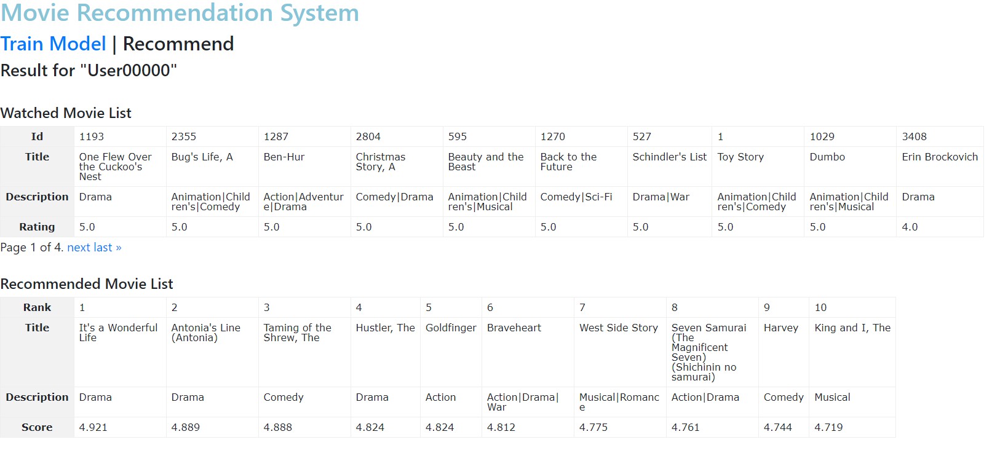

# 빅데이터 기반 영화 추천 알고리즘

## kNN
- k-Nearest Neighbors
- 데이터 포인트 주변의 k개의 가장 가까운 이웃 데이터 포인트를 기반으로 분류, 예측을 수행
 
## MF
- Matrix Factorization
- 협업 필터링. 사용자와 상품 간의 상호 작용 데이터를 행렬 분해하여 숨겨진 패턴을 발견.
- 사용자에게 맞춤형 추천을 제공

## MF + PLSI
- Probabilistic Latent Semantic Indexing
- 사용자와 아이템 간의 행렬 분해와 확률적 잠재 의미 색인을 통합하여 정확한 추천 및 정보 검색을 개선.
- 추천 시스템 및 정보 검색 분야에서 사용

## Details

  
  

## 실행
python -m venv venv

source venv/Scripts/activate

python manage.py makemigrations

python manage.py migrate

python manage.py runserver

